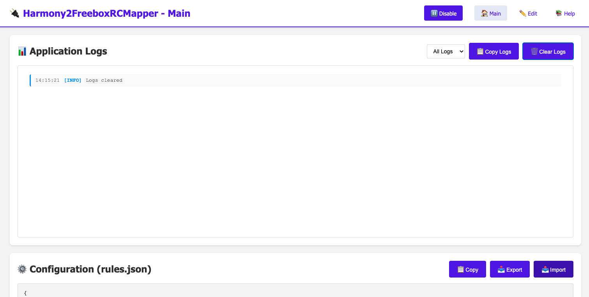
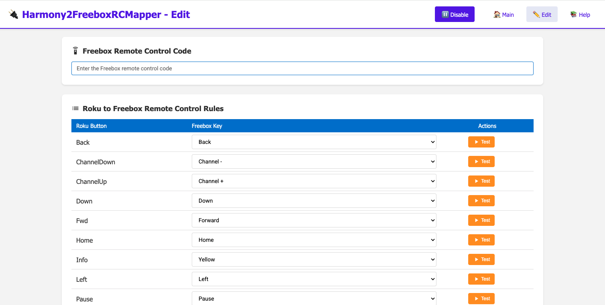

# Harmony2FreeboxRCMapper

Un serveur Node.js qui permet de contrôler votre Freebox via **une télécommande Logitech Harmony et son Hub** en émulant un appareil Roku.

## 🙏 Remerciements

Ce projet est inspiré de [EcpEmuServer](https://github.com/logantgt/EcpEmuServer) pour l'émulation du protocole Roku ECP.

## 📋 Prérequis

- Node.js (version 18 ou supérieure)
- Une Freebox avec l'API de télécommande activée
- Une télécommande Logitech Harmony Hub (**ne fonctionne pas sur une télécommande Harmony seul**)
- Le code de télécommande de votre Freebox

## 🎯 Fonctionnalités

- ✅ Émule un appareil Roku détectable par Harmony Hub
- ✅ Traduit les commandes Roku en commandes Freebox
- ✅ Interface web pour configurer les mappings de touches
- ✅ Logs en temps réel
- ✅ Configuration par défaut réinitialisable
- ✅ Test des touches en direct

## 🚀 Installation

1. **Cloner ou télécharger le projet**
   ```bash
   cd Harmony2FreeboxRCMapper
   ```

2. **Installer les dépendances**
   ```bash
   npm install
   ```

3. **Obtenir le code de télécommande Freebox**
   - Connectez-vous à votre Freebox : https://mafreebox.freebox.fr
   - Allez dans **Paramètres** → **Télécommande réseau**
   - Activez la télécommande réseau si ce n'est pas déjà fait
   - Notez le **code de télécommande** (8 chiffres)

4. **Démarrer le serveur**
   ```bash
   npm start
   ```

   Le serveur démarre sur `http://0.0.0.0:8042`

   > **Note :** Si vous avez plusieurs interfaces réseau, vous pouvez spécifier l'adresse IP à utiliser :
   ```bash
   node server.js 192.168.1.100
   ```

## 🎮 Configuration avec Harmony

### Étape 1 : Ajouter l'appareil Roku sur Harmony

1. **Ouvrir l'application Harmony**
   - Lancez l'application Harmony sur votre smartphone ou tablette
   - Connectez-vous à votre Hub

2. **Ajouter un nouvel appareil**
   - Appuyez sur **Menu** (☰) → **Configuration Harmony** → **Ajouter/Modifier les dispositifs et activités**
   - Sélectionnez **Dispositifs**
   - Appuyez sur **Ajouter un Dispositifs**

3. **Recherche automatique**
   - Sélectionnez **Recherchez des dispositifs sur votre réseau**
   - Harmony va détecter automatiquement le serveur Harmony2FreeboxRCMapper qui émule un appareil Roku
   - L'appareil devrait apparaître comme **"TCL Roku TV"** ou similaire

4. **Sélectionner l'appareil détecté**
   - Choisissez l'appareil **TCL Roku TV** dans la liste
   - Validez et terminez la configuration

5. **Alternative : Ajout manuel**

   Si la détection automatique ne fonctionne pas :
   - Choisissez **Ajouter un dispositif manuellement**
   - Fabricant : `Roku`
   - Modèle : `Roku 3` ou `Roku Streaming Stick`
   - Une fois ajouté, assurez-vous que votre Harmony et le serveur sont sur le même réseau

### Étape 2 : Configurer les touches

1. **Accéder à l'interface web**

   Ouvrez votre navigateur et allez sur :
   ```
   http://[IP_DU_SERVEUR]:8042/edit
   ```

   Exemple : `http://192.168.1.100:8042/edit`

2. **Entrer le code de télécommande Freebox**

   Dans le champ **"Freebox Remote Control Code"**, entrez le code à 8 chiffres obtenu depuis votre Freebox.

3. **Mapper les touches Roku → Freebox**

   Pour chaque bouton Roku (Back, Home, Play, etc.), sélectionnez la touche Freebox correspondante dans la liste déroulante :

   | Bouton Roku      | Touche Freebox suggérée |
   |------------------|-------------------------|
   | Back             | back                    |
   | ChannelDown      | prgm_dec                |
   | ChannelUp        | prgm_inc                |
   | Down             | down                    |
   | Fwd              | fwd                     |
   | Home             | home                    |
   | Info             | yellow                  |
   | Left             | left                    |
   | Pause            | pause                   |
   | Play             | play                    |
   | PowerOff/PowerOn | power                   |
   | Rev              | bwd                     |
   | Right            | right                   |
   | Select           | ok                      |
   | Up               | up                      |
   | VolumeDown       | vol_dec                 |
   | VolumeMute       | mute                    |
   | VolumeUp         | vol_inc                 |

4. **Tester les touches**

   Cliquez sur le bouton **Test** à côté de chaque touche pour vérifier qu'elle fonctionne correctement avec votre Freebox.

5. **Enregistrer la configuration**

   Cliquez sur le bouton **Save** (vert) pour sauvegarder vos changements.

### Étape 3 : Utiliser avec Harmony

Une fois configuré :
- Les boutons de votre télécommande Harmony enverront automatiquement les commandes à la Freebox
- Vous pouvez activer/désactiver l'exécution des règles via l'interface web
- Les logs sont visibles en temps réel sur la page principale : `http://[IP_DU_SERVEUR]:8042`

## 🔧 Interface Web

Le serveur expose plusieurs pages web :

### Page principale - Logs en temps réel
```
http://[IP_DU_SERVEUR]:8042/
```



- Affiche les logs en temps réel avec filtrage (All/Info/Warning/Error)
- Copier les logs dans le presse-papiers
- Permet d'activer/désactiver l'exécution des règles
- Bouton pour effacer les logs
- Visualisation de la configuration actuelle avec copie/export/import

### Page d'édition - Configuration
```
http://[IP_DU_SERVEUR]:8042/edit
```



- Configuration du code de télécommande Freebox
- Mapping des touches Roku → Freebox
- Test individuel de chaque touche
- Bouton **Reset to Default** pour restaurer la configuration par défaut

## 📁 Fichiers de configuration

### `rules.json`
Contient la configuration actuelle :
```json
{
  "remoteControlId": "",
  "rules": [
    {
      "Button": "Home",
      "Key": "home"
    }
  ]
}
```

### `rules_default.json`
Configuration par défaut, utilisée lors d'un reset.

## 🛠️ Dépannage

### Le serveur ne démarre pas
- Vérifiez que le port 8042 n'est pas déjà utilisé
- Vérifiez que Node.js est bien installé : `node --version`

### Harmony ne détecte pas l'appareil
- Assurez-vous que le serveur et Harmony Hub sont sur le même réseau local
- Redémarrez le serveur et relancez la détection
- Vérifiez les logs du serveur pour voir les requêtes SSDP
- Essayez de spécifier manuellement l'adresse IP au démarrage

### Les commandes ne fonctionnent pas
- Vérifiez que le code de télécommande Freebox est correct
- Testez les touches individuellement via l'interface web
- Vérifiez les logs en temps réel pour voir les erreurs
- Assurez-vous que la télécommande réseau est activée sur la Freebox

### L'appareil apparaît mais ne répond pas
- Vérifiez que le mapping des touches est correct dans `/edit`
- Testez avec le bouton **Test** pour chaque touche
- Vérifiez que les règles ne sont pas désactivées (bouton Enable/Disable)

## 🔑 Touches Freebox disponibles

Voici la liste complète des touches supportées par l'API Freebox :

- **Navigation** : `up`, `down`, `left`, `right`, `ok`
- **Contrôle** : `power`, `back`, `home`
- **Volume** : `vol_inc`, `vol_dec`, `mute`
- **Chaînes** : `prgm_inc`, `prgm_dec`
- **Lecture** : `play`, `pause`, `fwd` (avance rapide), `bwd` (retour rapide), `rec` (enregistrement)
- **Couleurs** : `red`, `green`, `yellow`, `blue`
- **Autres** : `list`, `tv`, `media`, `free`

## 📝 Licence

Ce projet est distribué sous la licence MIT.

### Licence MIT

Copyright (c) 2025 Harmony2FreeboxRCMapper

Permission is hereby granted, free of charge, to any person obtaining a copy
of this software and associated documentation files (the "Software"), to deal
in the Software without restriction, including without limitation the rights
to use, copy, modify, merge, publish, distribute, sublicense, and/or sell
copies of the Software, and to permit persons to whom the Software is
furnished to do so, subject to the following conditions:

The above copyright notice and this permission notice shall be included in all
copies or substantial portions of the Software.

THE SOFTWARE IS PROVIDED "AS IS", WITHOUT WARRANTY OF ANY KIND, EXPRESS OR
IMPLIED, INCLUDING BUT NOT LIMITED TO THE WARRANTIES OF MERCHANTABILITY,
FITNESS FOR A PARTICULAR PURPOSE AND NONINFRINGEMENT. IN NO EVENT SHALL THE
AUTHORS OR COPYRIGHT HOLDERS BE LIABLE FOR ANY CLAIM, DAMAGES OR OTHER
LIABILITY, WHETHER IN AN ACTION OF CONTRACT, TORT OR OTHERWISE, ARISING FROM,
OUT OF OR IN CONNECTION WITH THE SOFTWARE OR THE USE OR OTHER DEALINGS IN THE
SOFTWARE.

## 🤝 Contribution

Les contributions sont les bienvenues ! N'hésitez pas à ouvrir une issue ou une pull request.

## 📧 Support

Pour toute question ou problème, consultez les logs en temps réel sur l'interface web ou vérifiez la console du serveur.
